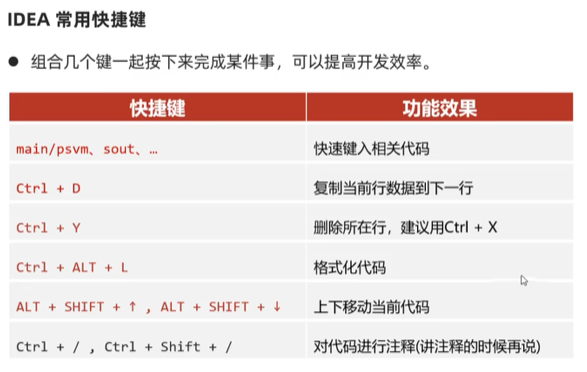

# JAVA学习日记
## 第一部分 Java入门
###  IDEA软件  
1.  安装下载：官网 Intellij idea  
2.  项目--模块--包--类  
    小区--楼栋--层--户

### 如何在IEDA中创建一个工程
1. 创建工程：Project（空工程）  
   (名称:javasepro 路径后面也加上项目名称)
2. 创建模块：在工程上新建Module(File-new-module(java模块) )  
   (名称：helloworld-app)
3. 创建包：在Module下的src中新建Package，公司域名倒着写  
   com.itheima.hello（小写)  
   src是源代码的位置
4. 创建类：在包上新建类-JavaClass  
   首字母大写，全部用英文 HelloWorld
5. ①main/psvm:提示执行架子        sout:提示打印语句(Hello World.sout--回车)  
   ②右键RUN：程序跑起来--运行结果在操控台查看  
   ③OUT目录：CLASS文件所在处  
   ④2级包在Scr下建   
   ⑤直接进入工程：右键--OPEN IN--EXPLORER
  

###  IDEA的设置  
1.  设置皮肤颜色：  
    File--Setting--Appearance--Theme--选颜色(intellij light)--OK  
2.  设置字体大小：  
    Appearance--Editor--font--size--OK  
    代码一页30行比较合适  
3.  设置代码的背景色:  
    Editor--color scheme--General--Text--Default text--background--选颜色--OK
    (豆沙绿 204--238--200)  
4.  删除类名称：右键--DELETE  
5.  修改类名称：右键--Refactor--Rename--Refactor(把勾都去掉)  
6.  删除模块：右键--Remove Module(进入到工程目录再次删除 Ctrl＋D)  
6.  修改模块：右键--Refactor--Rename--选第三个Rename Module and directory  
7.  打开工程：File--open--输入需要打开工程的路径--小黑点--OK  
8.  关闭工程：File--Close Project  
9.  导入模块：  
    ①  复制要导入的模块的src的com，粘贴到一个新建的模块的src里--OK  
    ②  复制要导入的模块--粘贴到我的工程中(code文件夹)--复制code中的要导入模块的路径的链接--File--New--module from existing sources--粘贴路径--点小黑点--OK  
    ③  先找到要导入模块的位置，COPY它的路径--进入到File--New--module from existing sources粘贴路径--点小黑点--OK  

###  IDEA的快捷键
  
1.  格式化代码：规范代码位置  
2.  撤销上一步操作：Ctrl＋Z  

###  英文单词  
1.  expected:期望的  
2. 
    