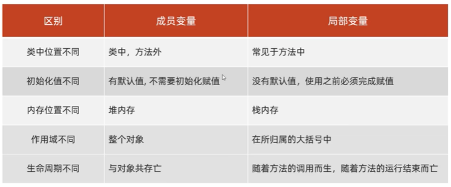

# 第七部分 面向对象编程  
### 面向对象编程快速入门  
开发一个一个的对象，把数据交给对象，再调用对象的方法来完成对数据的处理  
  

### this  
是一个变量，可以用在方法中，来拿到当前对象  
应用场景：用来解决变量名称冲突问题  

###  构造器  
特点：创建对象时，对象会去调用构造器  
应用场景：创建对象时，同时完成对对象成员变量（属性）的初始化赋值  
  

###  封装  
用类设计对象处理某一个事物的数据时，应该把要处理的数据，以及处理这些数据的方法，设计到一个对象中去  
设计规范：合理隐藏 合理暴露  
代码层面公开成员：可以使用public（公开）进行修饰  
代码层面隐藏成员：使用private（私有 隐藏）进行修饰  
  

###  实体类--实体JavaBean
一种特殊形式的类  
① 这个类中的成员变量都要私有，并且要对外提供相应的getXxx,setXxx方法  
② 类中必须要有一个公共的无参的构造器  
  

###  面向对象编程综合案例  
  
见代码  

###  成员变量 局部变量的区别  
  

P75个视频  

