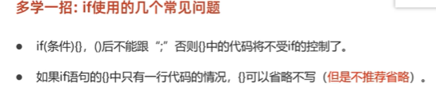
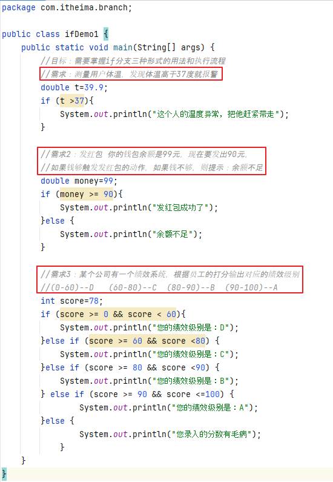
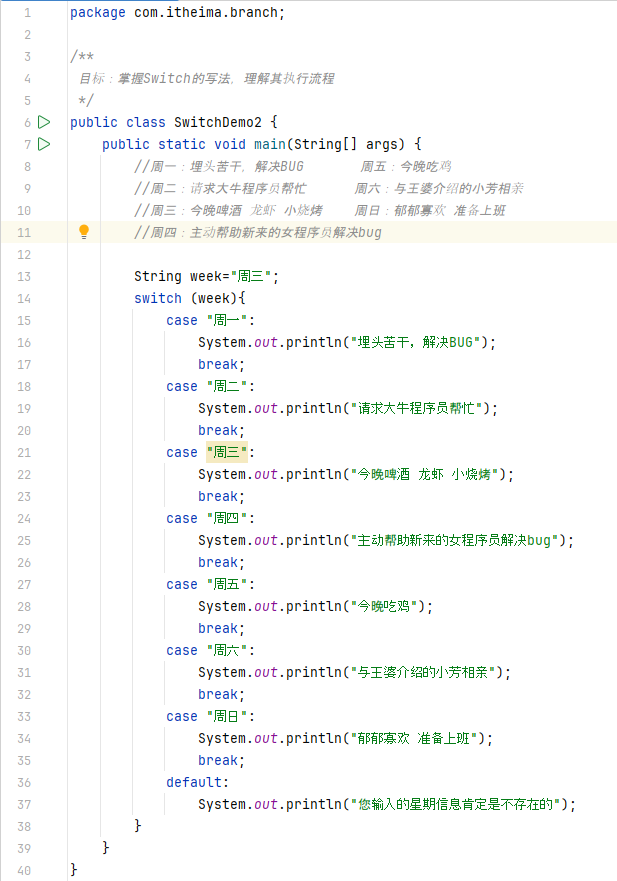
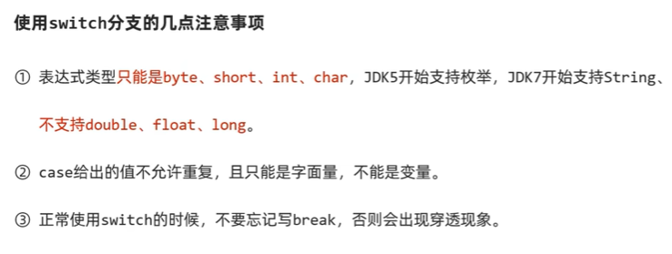
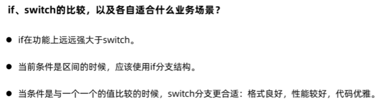
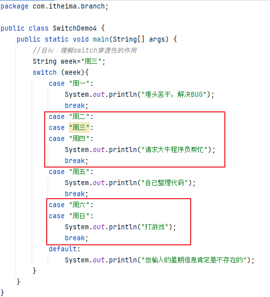

## 流程控制    
###  执行顺序  
1.  分类：  
顺序结构：自上而下的执行代码  
分支结构：根据条件，选择对应代码执行(if  switch)  
循环结构：控制某段代码重复执行 (for  while do-while )  
2. 分支结构  
① if分支  
根据条件（真或假）来决定执行某段代码  
  
  
  
②switch分支  
通过比较值来决定执行哪条分支  
  
  
注意：  
  
  
switch的穿透性：当存在多个case分支的代码相同时，可以把相同的代码放到一个case块中，其他的case块都通过穿透性穿透到该case块执行代码即可，这样可以简化代码：  
  

P39

 