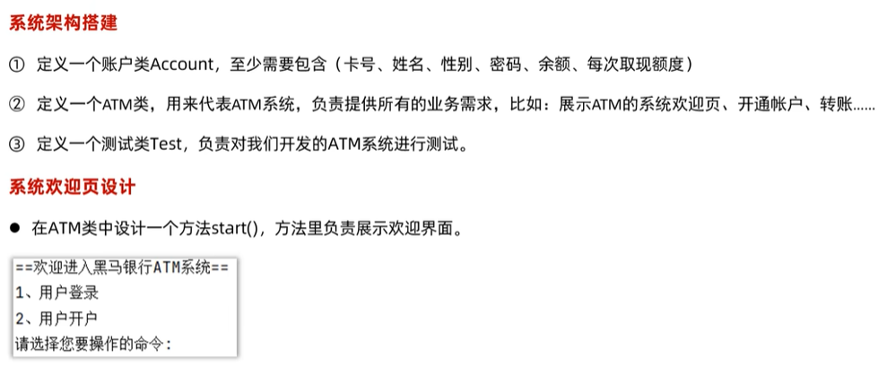
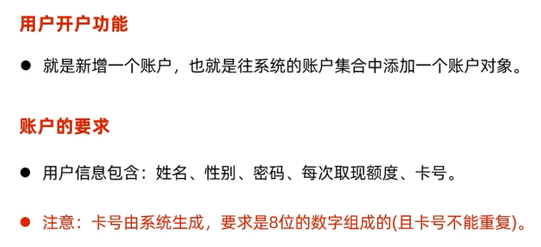
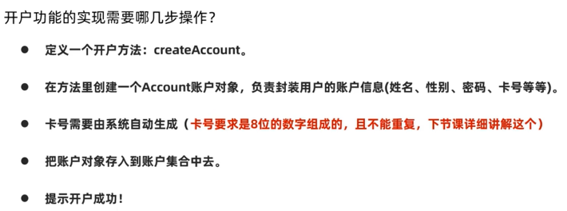
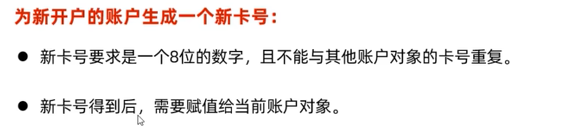
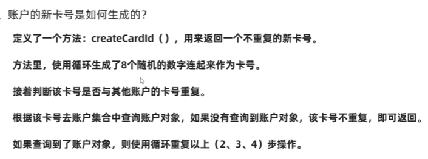
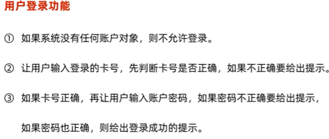
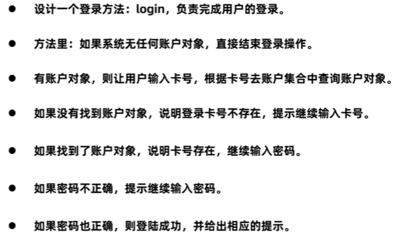
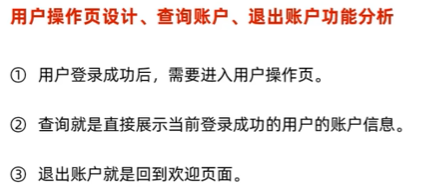

# 第九部分 项目实战(ATM项目)  

### 1.  系统架构搭建，欢迎页设计  
  
### 2.  开户功能实现  
  
  
  
  
### 3.  登录功能实现  
  
  
### 4.  操作页展示，查询账户，退出账户  
   
### 5.  取款，取款功能实现  

### 6.  转账功能实现  

### 7.  销户功能实现  

### 8.  用户密码修改 

p88  

 

