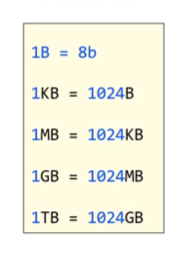
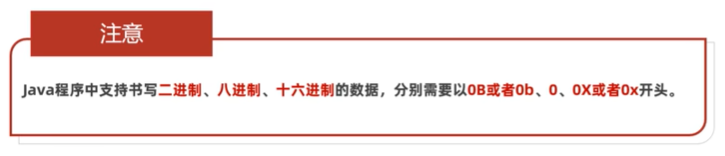

## 第二部分 Java语法
###  数据类型的大小
1.  计算机中表示数据的最小单元：字节(简称B)  
    字节中的每个二进制位就称为位，(简称b)  
    一个字节等于8个二进制位：1B=8b  
    在B的基础上，计算机发展出了KB,MB,GB,TB..这些数据单位  
      
2.  十进制转二进制：除二取余法    
    二进制转十进制：命令行窗口输入calc打开计算器左上角选择程序员  
3.  计算一个数据的二进制形式：除二取余法
4.  数据在计算机底层的存储：采用二进制，使用0 1，按照逢2进1的规则表示数据来存储  
    字符在计算机中的存储：ASCII编码表中对应的数字的二进制形式  
    eg:字符a对应的数字是97    字符A对应的数字是65    字符0对应的数字是48  
5. 注意：
   

P24
