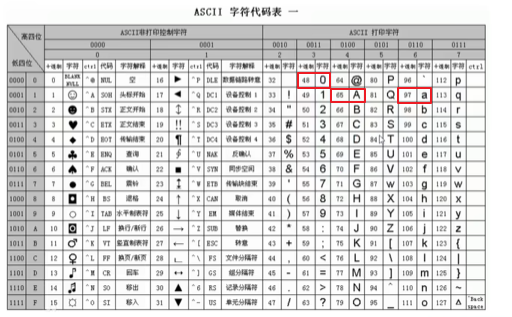
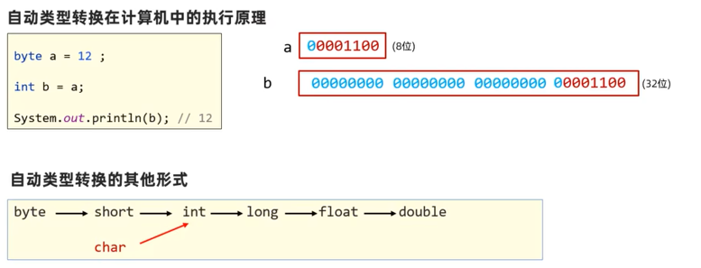
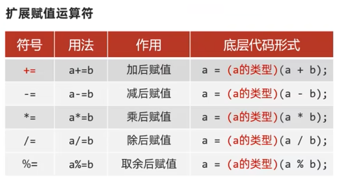
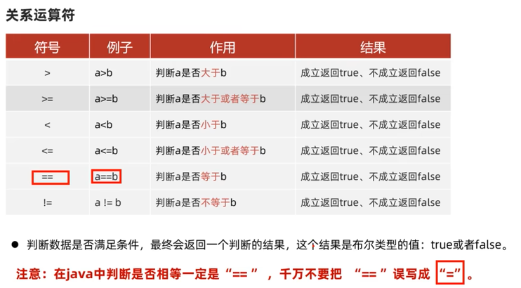

# 第二部分 Java语法
##   数据类型
###  数据类型的大小
1.  计算机中表示数据的最小单元：字节(简称B)  
    字节中的每个二进制位就称为位，(简称b)  
    一个字节等于8个二进制位：1B=8b  
    在B的基础上，计算机发展出了KB,MB,GB,TB..这些数据单位  
      
2.  十进制转二进制：除二取余法    
    二进制转十进制：命令行窗口输入calc打开计算器左上角选择程序员  
3.  计算一个数据的二进制形式：除二取余法
4.  数据在计算机底层的存储：采用二进制，使用0 1，按照逢2进1的规则表示数据来存储  
    字符在计算机中的存储：ASCII编码表中对应的数字的二进制形式  
    eg:字符a对应的数字是97    字符A对应的数字是65    字符0对应的数字是48  

5. 注意： 

   

###  数据类型的分类
分为：基本数据类型和引用数据类型  

  

###  类型转换  
1.  自动类型转换： 类型范围小的变量，可以直接赋值给类型范围大的变量  
eg:byte类型的赋值给int类型  
  
2.  表达式的自动类型转换：在表达式中，小范围类型的变量，会自动转换成表达式中较大范围的类型，再参与运算  
表达式的最终结果类型由表达式中的最高类型决定  
在表达式中，byte,short,char是直接转换成int类型参与运算的  
  
  
3.  强制类型转换：类型范围大的数据或者变量，直接赋值给类型范围小的变量，会报错  
强行将类型范围大的变量，数据赋值给类型范围小的变量  
注意：小数型强转成整型，直接丢掉小数部分，保留整数部分返回  
  
  

###  运算符  
对变量，字面量进行运算的符号  
1.  基本的算术运算符  
  
  
2. "+"符号可以做连接符  
"abc+5"--"abc5"  
什么时候是连接符，什么时候是加法：能算则算，不能算就在一起  
  
3.  自增自减运算符  
方便的对变量的值进行+1或-1  
++，--只能操作变量，不能操作字面量  
      
++，--如果不是单独使用，放在变量前后会存在明显区别  
    
  
4.  赋值运算符  
"="  从右往左看  
扩展赋值运算符  
  
  
5.  关系运算符  
判断数据是否满足条件，最终会返回一个判断的结果，这个结果的布尔类型的值：true或者false  
  
  
6.  逻辑运算符  
把多个条件放在一起运算，最终返回布尔类型的值：ture/false  

  

p34

 
