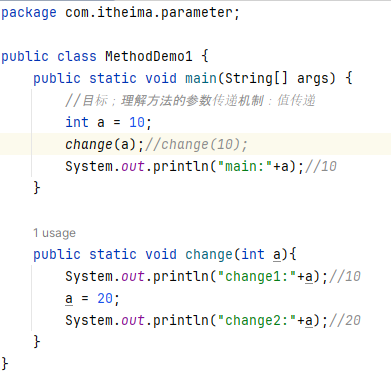
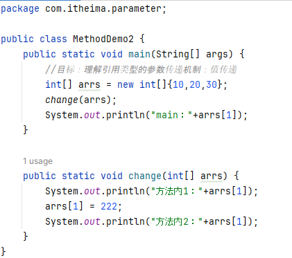
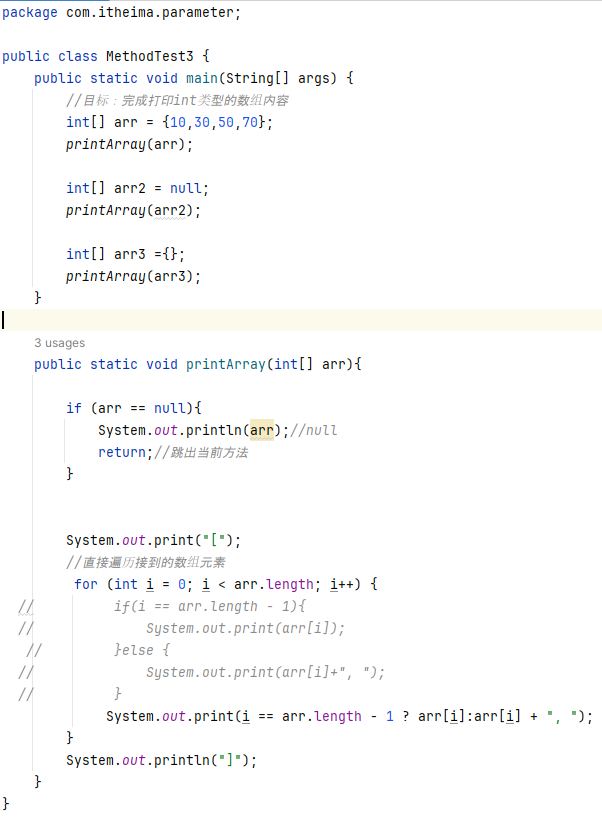
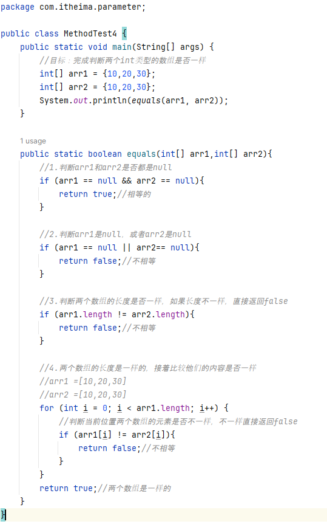
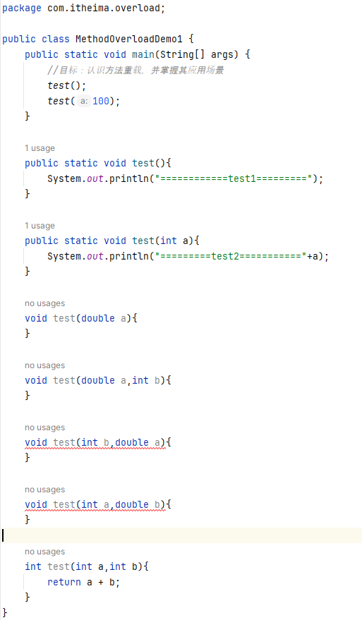
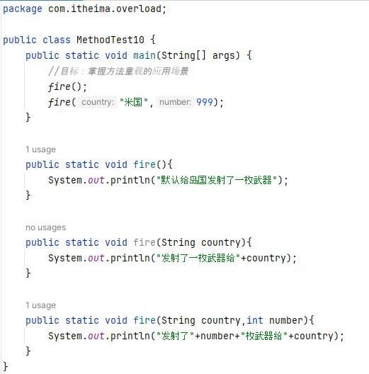
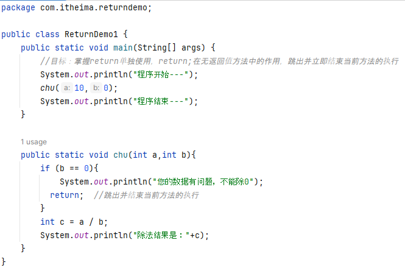

# 第五部分 Java方法  

###  方法  
方法是一种语法结构，它可以把一段代码封装成一个功能，以便重复调用  
格式：  
  
  

###   方法的其他形式  
需要按照方法解决的实际业务需求，来设计合理的方法形式解决问题  
  
  
  

###   方法使用时的常见问题  

###   设计方法的技巧  
1.  方法是否需要接收数据进行处理  
2.  方法是否需要返回数据  
3.  方法要处理的业务（编程能力）  

###  案例  
1.  求1--n的和  
2.  判断一个整数是奇数还是偶数  
  

###  方法在计算机中的执行原理  
方法被调用的时候，是进入到栈内存中运行  

###  Java的参数传递机制
值传递：在传输实参给方法的形参的时候，传输的是实参变量中存储的值的副本  
实参：在方法内部定义的变量  
形参：定义方法时（  ）中所声明的参数  
1.  基本类型的参数传递  
  
2.  引用类型的参数传递  
  
3. 案例  
①输出一个Int类型的数组内容，要求输出格式为：{11，22，33，44，55}  
  
②比较两个int类型的数组是否一样，返回true或者false  
  

###  方法重载  
一个类中，出现多个方法的名称相同，但是他们的形参列 表是不同的，那么这些方法就成为方法重载了  
注意：形参列表不同：形参的个数，类型，顺序不同，不关心形参的名称  
  
案例  
开发武器系统：  
①可以默认发一枚武器②可以指定地区发射一枚武器③可以指定地区发射多枚武器  
  

###  在方法中单独使用return关键字  
return;可以用在无返回值的方法中，作用是：立即跳出并结束当前方法的执行  
  

 
