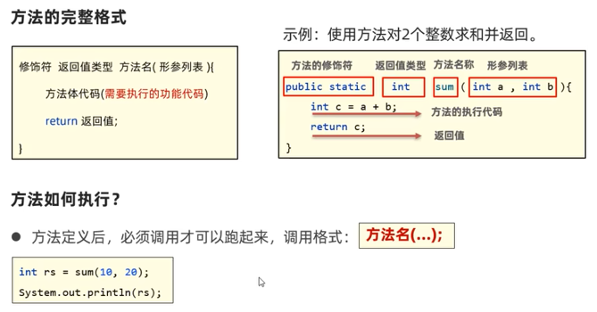
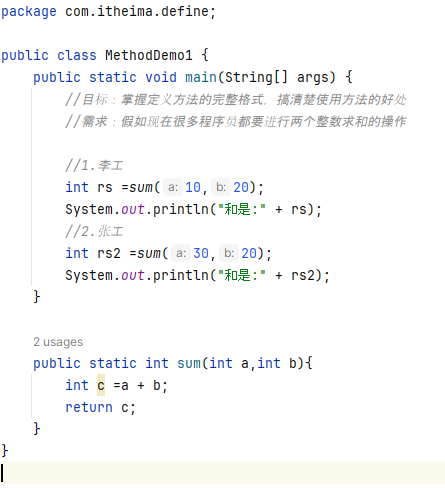
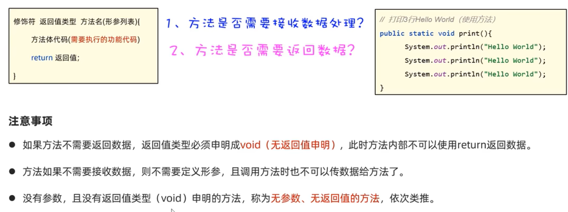
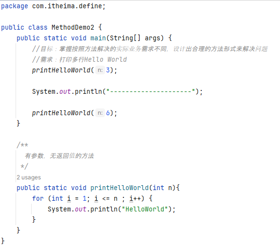
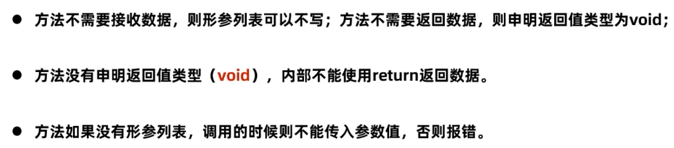
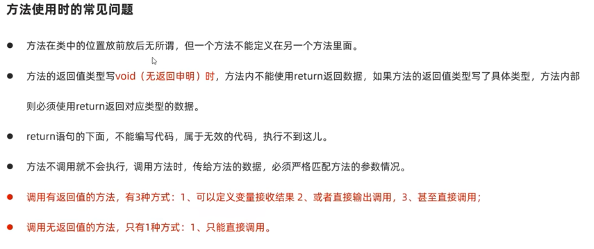
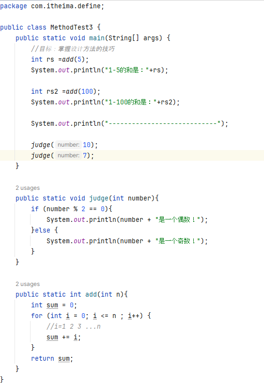

# 第五部分 Java方法  

###  方法  
方法是一种语法结构，它可以把一段代码封装成一个功能，以便重复调用  
格式：  
  
  

###   方法的其他形式  
需要按照方法解决的实际业务需求，来设计合理的方法形式解决问题  
  
  
  

###   方法使用时的常见问题  

###   设计方法的技巧  
1.  方法是否需要接收数据进行处理  
2.  方法是否需要返回数据  
3.  方法要处理的业务（编程能力）  

###  案例  
1.  求1--n的和  
2.  判断一个整数是奇数还是偶数  
  

###  方法在计算机中的执行原理  
方法被调用的时候，是进入到栈内存中运行  

P58

 
