# 第八部分 常用API(应用程序编程接口)  

### String  
1.  String概述  
代表字符串，可以用来创建对象封装字符串数据，并对其进行处理  
创建对象:  
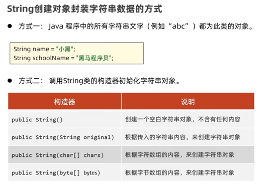  
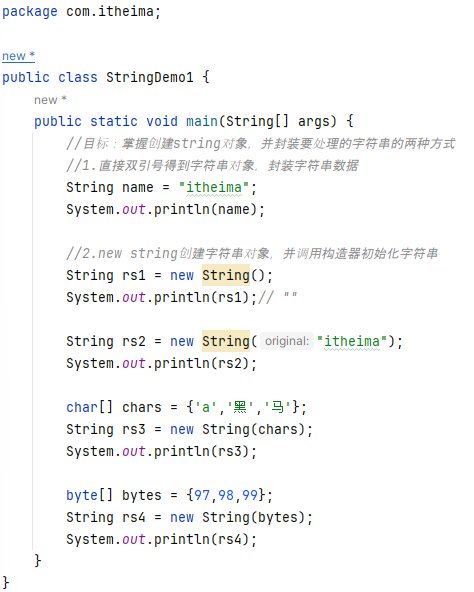  
2.  String的常用方法  
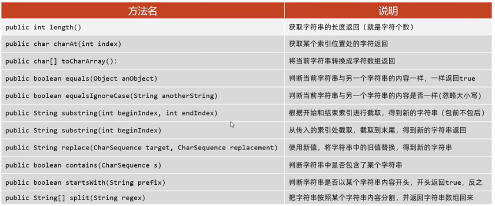  
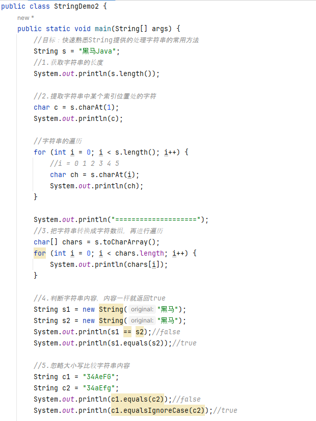  
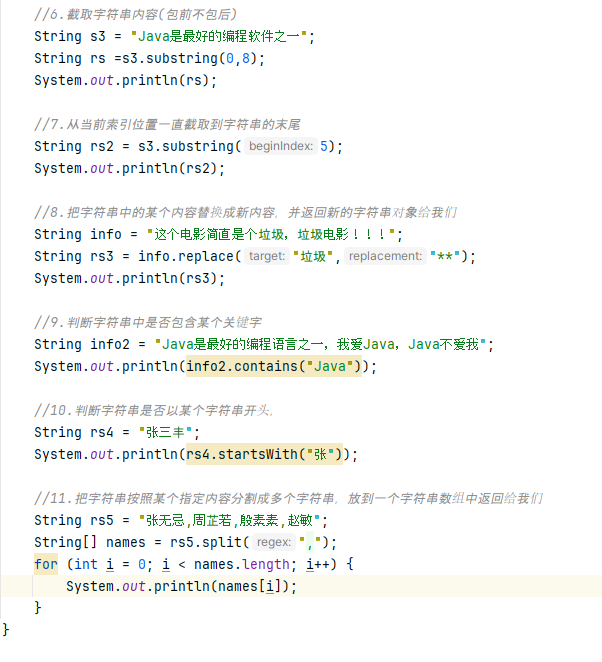  
3.  String使用时的注意事项  
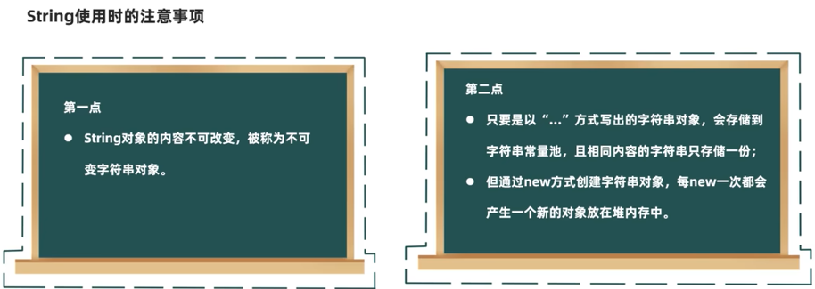  
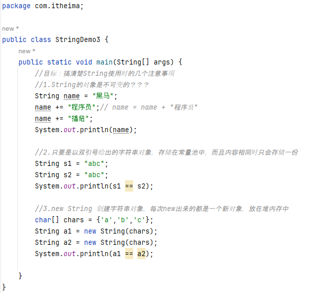  
4.  String的应用案例  
案例一：完成用户登录  
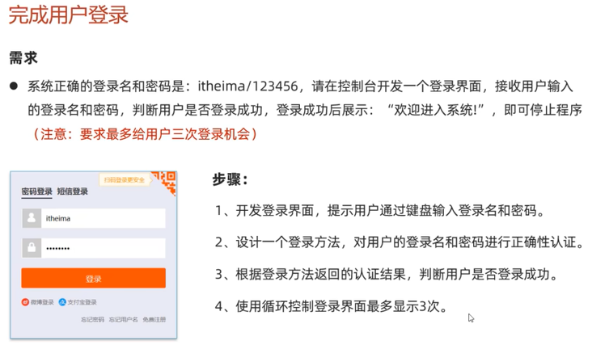  
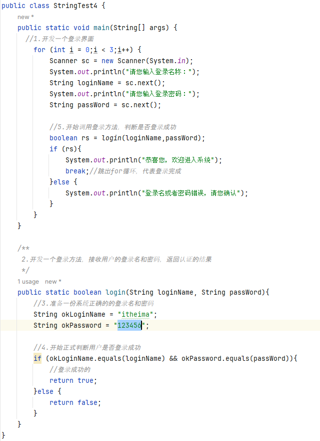  
注意：  
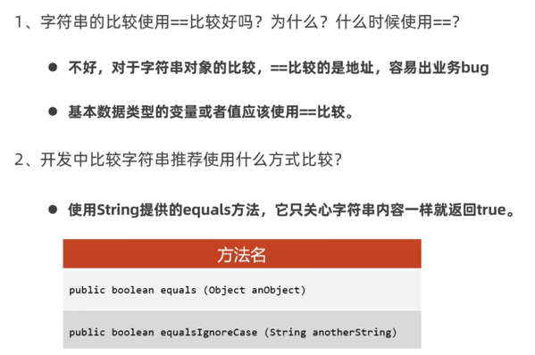  
案例二：使用String来开发验证码  
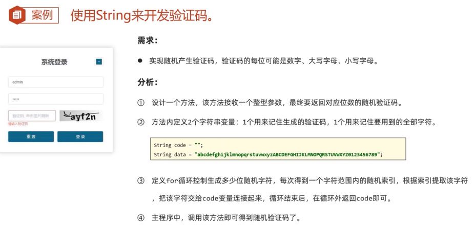  
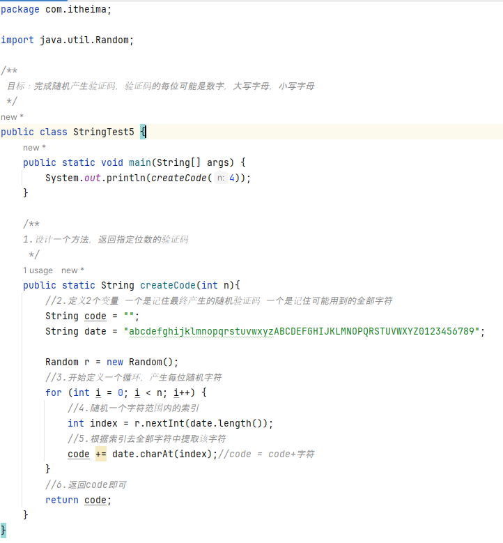  

### ArrayList  
1. ArrayList快速入门   
   ①集合是一种容器，用来装数据的，类似于数组  
   ②数组定义完成并启动后，长度就固定了  
   ③集合大小可变，开发中用的更多  
常用方法：  
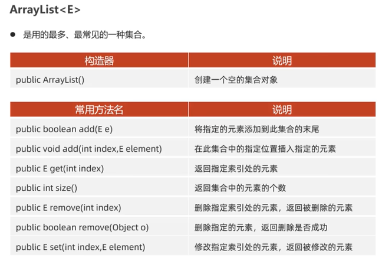  
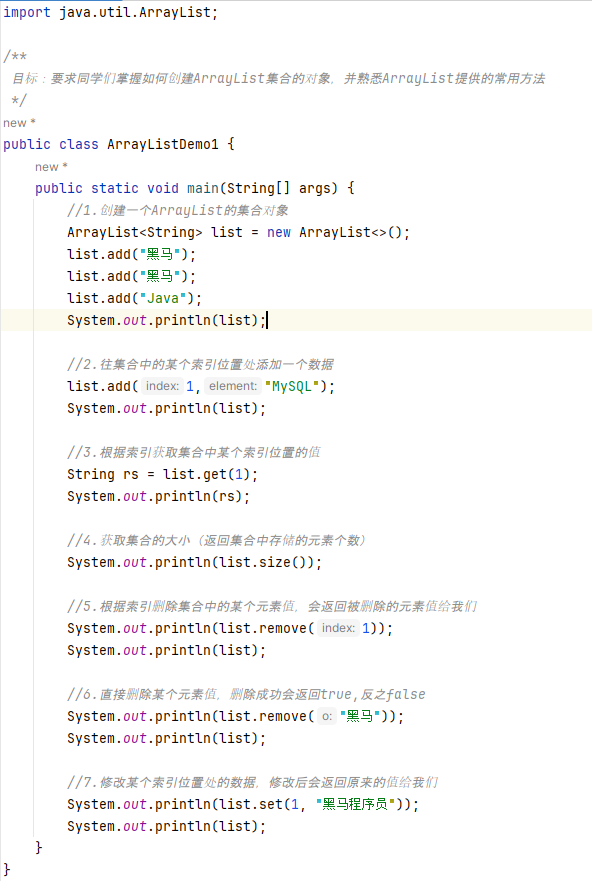  
2. ArrayList应用案例  
掌握从容器中找出某些数据并成功删除的技巧  
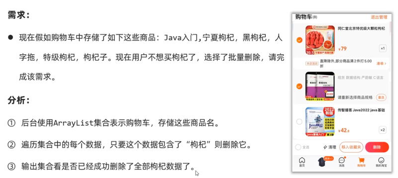  
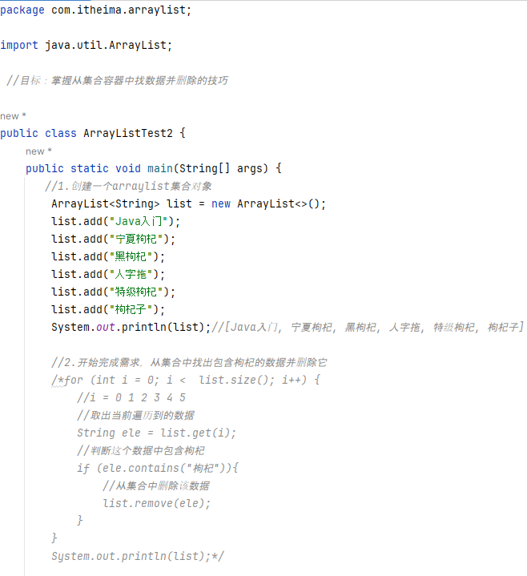  
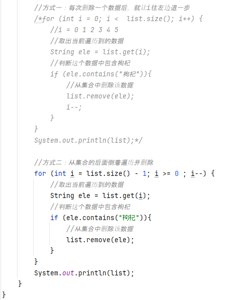  
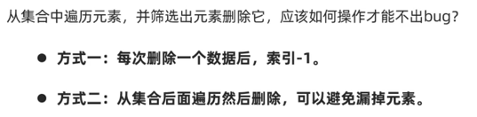  
3. ArrayList综合案例  

p82个视频

 

