# 第六部分 Java案例  

##  案例一  
###  买飞机票  
  
  
注意：  
1.  遇到需要通过判断数据在哪个区间，来决定执行哪个业务，应该使用if分支结构实现  
2.  遇到需要通过判断数据匹配哪个值，来决定执行哪个业务，应该使用switch分支结构实现  
##  案例二  
###  开发验证码  
  
  

##  案例三  
###  评委打分  
  
  
  
##  案例四  
###  数字加密  
  
  
  
##  案例五  
###  数组拷贝  
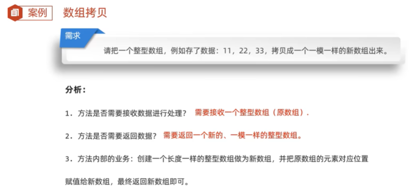  
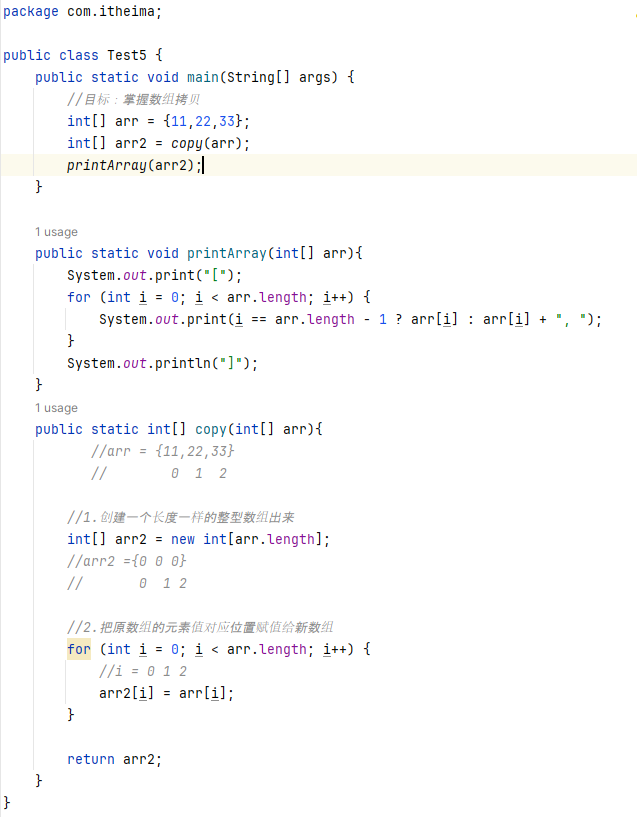  
##  案例六  
###  抢红包  
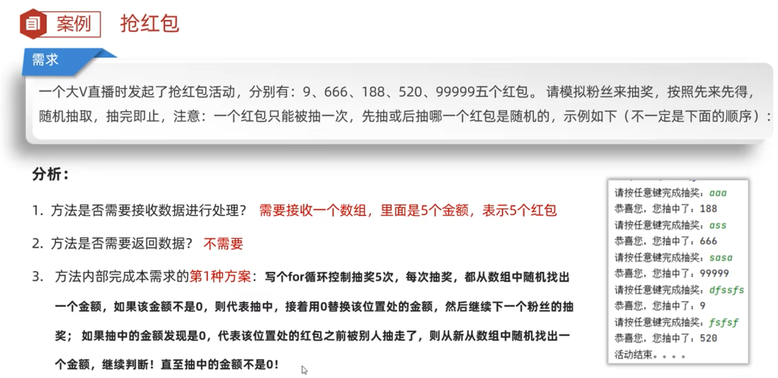  
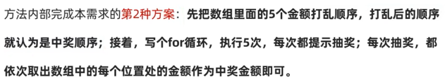  
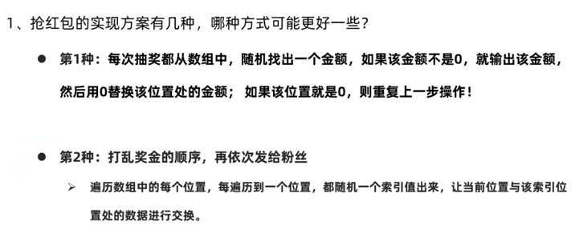  
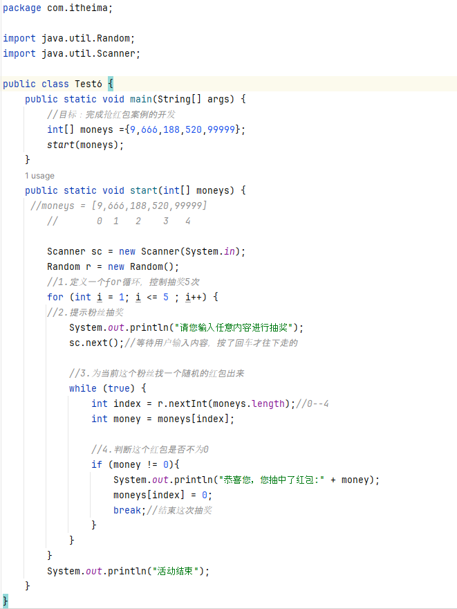  
##  案例七  
###  找素数  
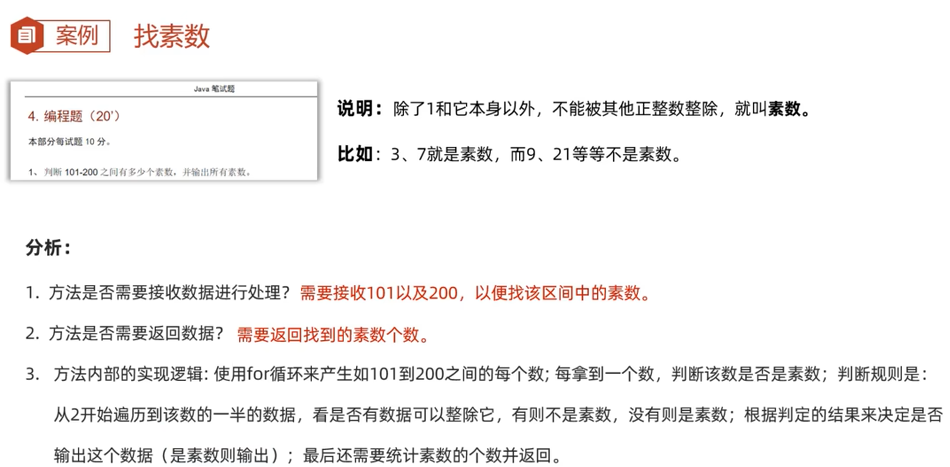  
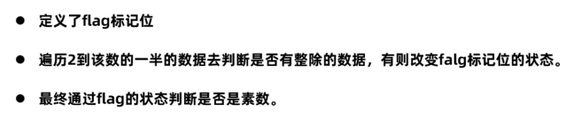  
方法一:  
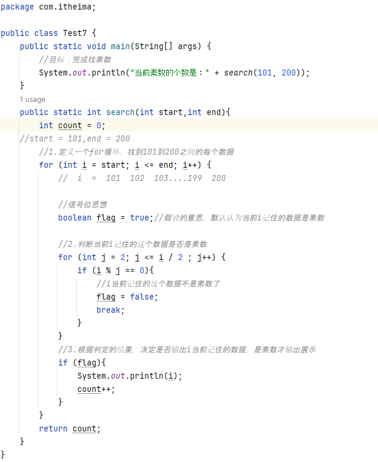  
方法二：  
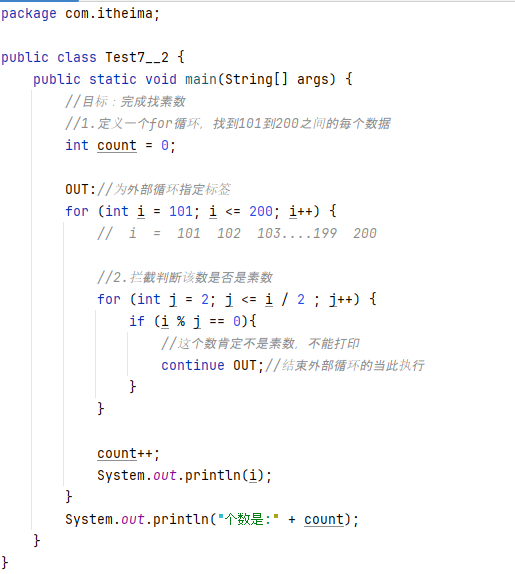  
方法三：  
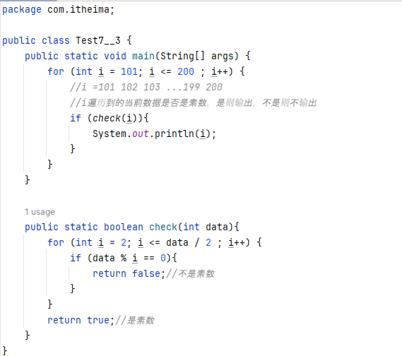  
##  案例八  
###   打印九九乘法表     
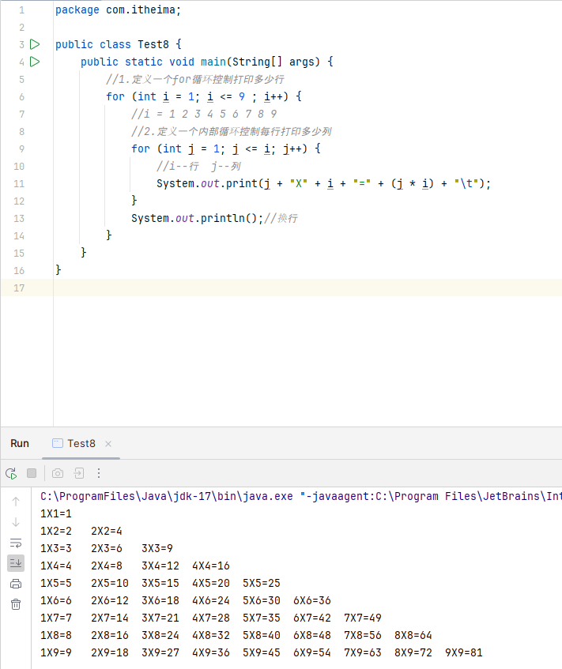  
###  打印三角形  
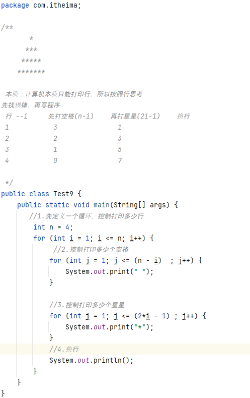  
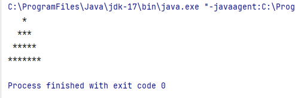  
##  案例九  
###  模拟双色球  
1.  用户投注一组号码  
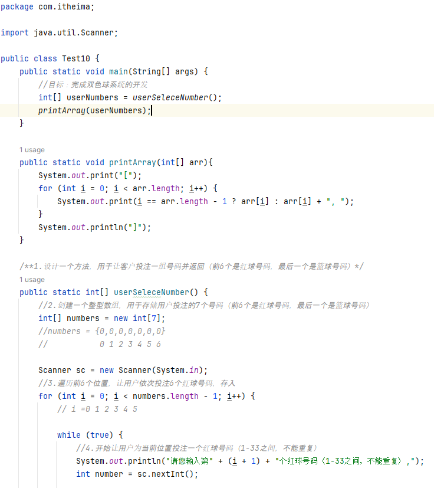  
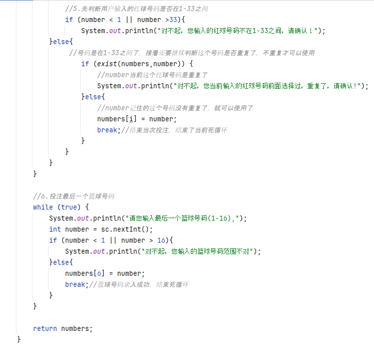  
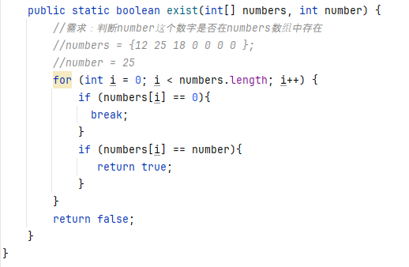  
2.  随机生成一组中奖号码  
3.  判断中奖情况  

P68个视频  27分钟

