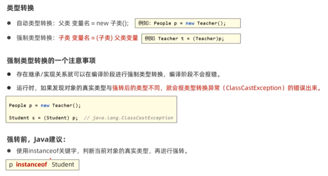
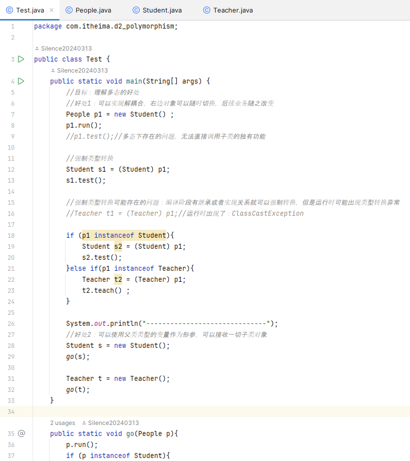
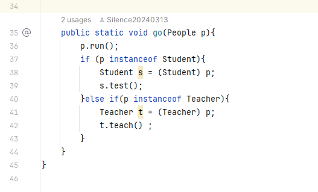
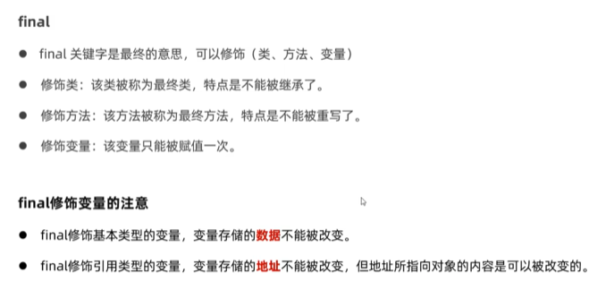
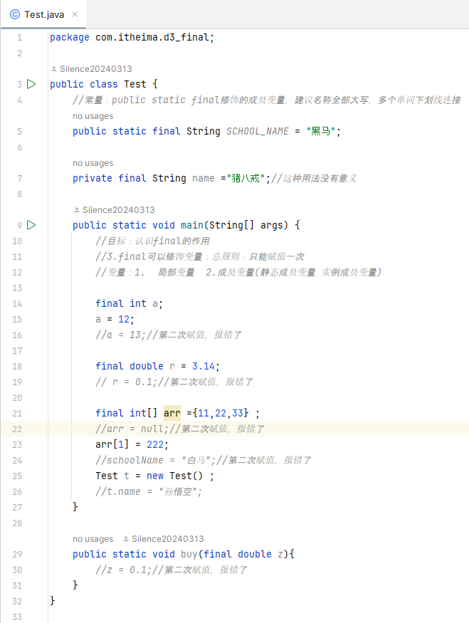
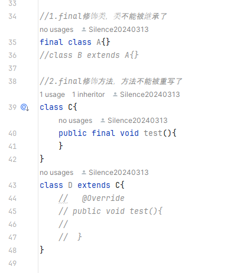
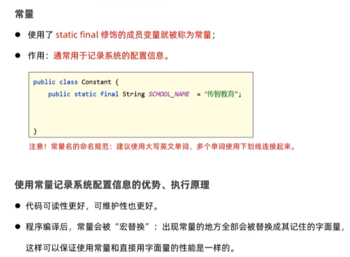

# 第二阶段 基础加强课程  

##  面向对象高级二  

###  多态  
1. 认识多态  
多态是在继承，实现情况下的一种现象，表现为：对象多态，行为多态  
前提：有继承，实现关系；存在父类引用子类对象；存在方法重写  
多态是对象，行为的多态，Java中的属性不谈多态  
  
2. 使用多态的好处  
在多态形式下，右边对象是解耦合的，更便于扩展和维护  
定义方法时，使用父类类型的形参，可以接收一切子类对象，扩展性更强，更便利  
多态下不能使用子类的独有功能  
3. 多态下的类型转换问题  
  
  
  
4. final  
  
  
  
常量：  
  
5. 抽象类  

6. 接口  

106   

 