# 第二阶段 基础加强课程  

##  面向对象高级一  

###  static
1.  static修饰成员变量    
    static：叫静态，可以修饰成员变量，成员方法  
    成员变量：按照有无static修饰，分为：  
    ①类变量：有static修饰，属于类，在计算机里只有一份，会被类的全部对象共享     
    ②实例变量（对象的变量）：无static修饰，属于每个对象的  
      
    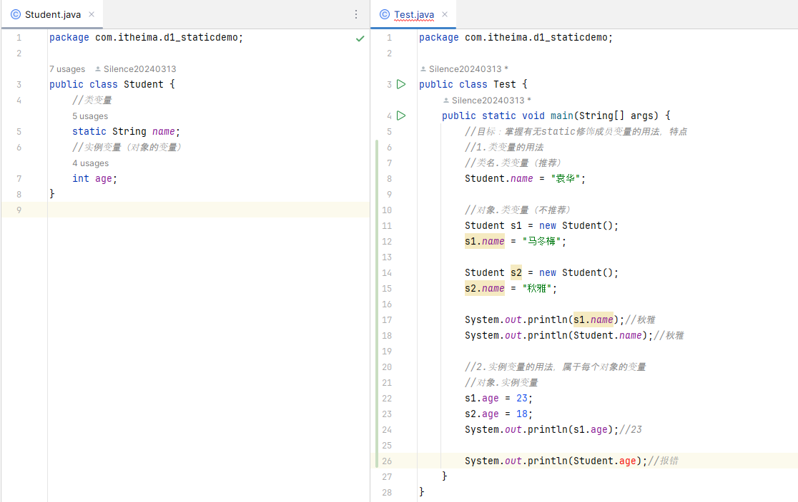  
2.  static修饰成员变量的应用场景  
在开发中，如果某个数据只需要一份，且希望能够被共享（访问，修改），则该数据可以定义成类变量来记住  
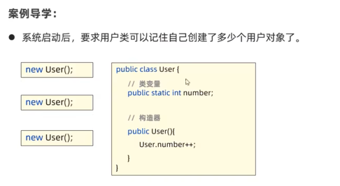  
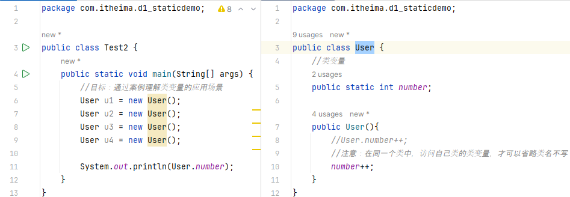  
3.  static修饰成员方法   
①类方法：有static修饰的成员方法，属于类  
②实例方法：无staticc修饰的成员方法，属于对象  
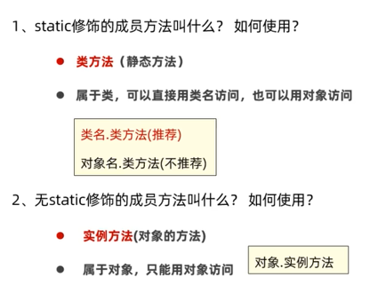  
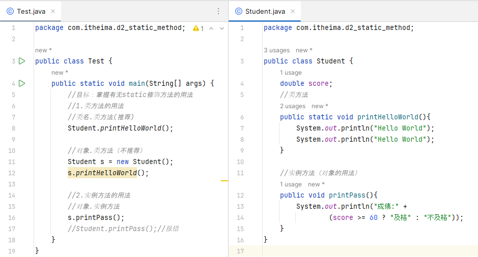  
4.  static修饰成员方法的应用场景   
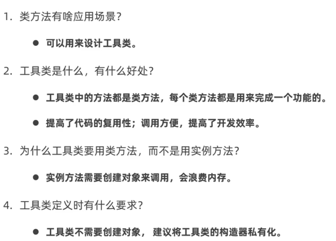  
5.  static的注意事项    
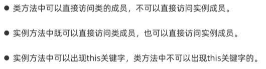  
6.  static的应用知识：代码块    
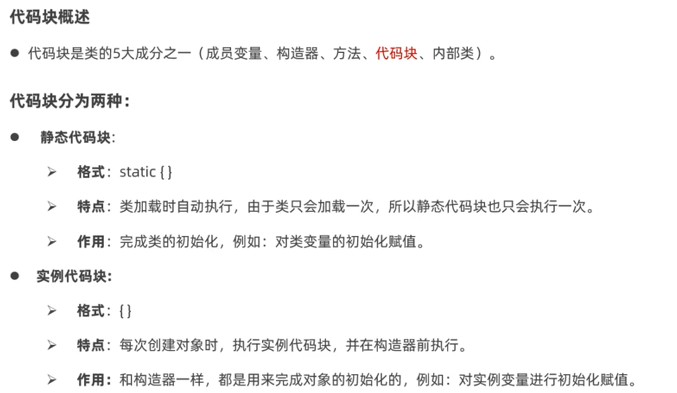  
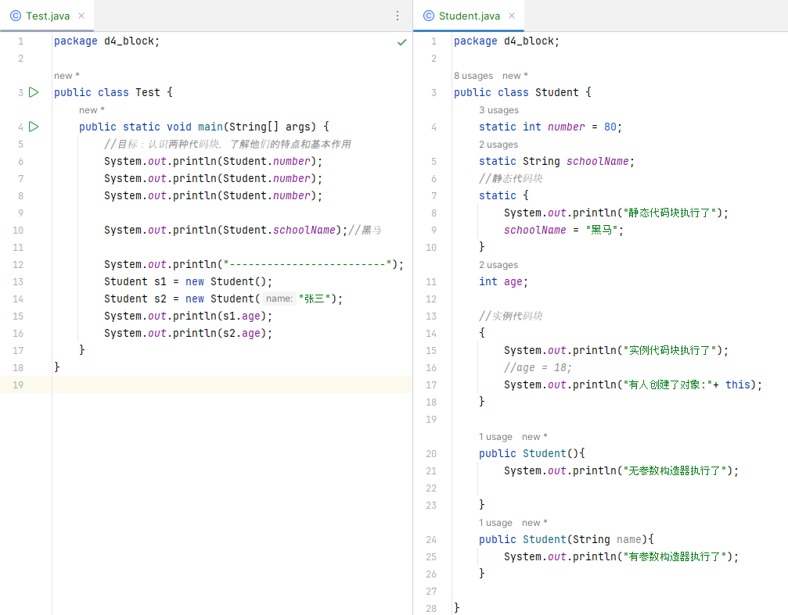  
7.  static的应用知识：单例设计模式  
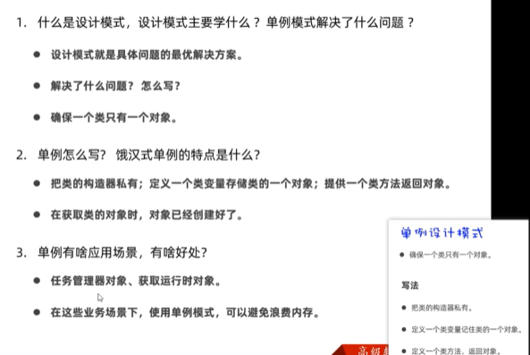  
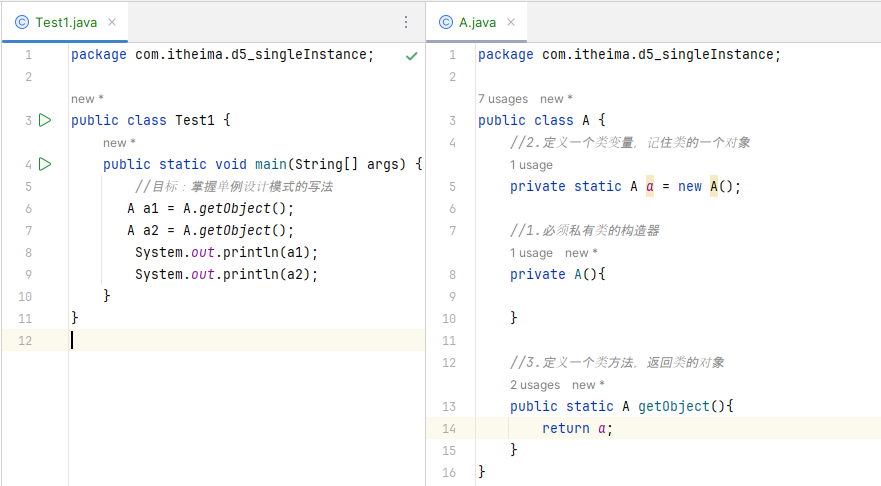  
懒汉式单例设计模式：  
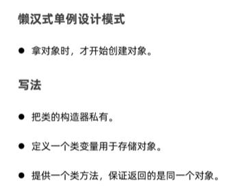  
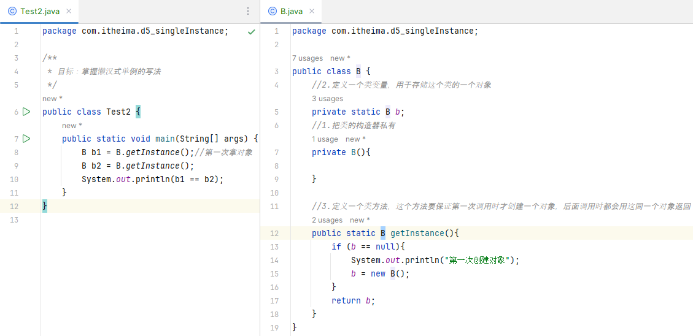  

###  继承  
1.  概念  
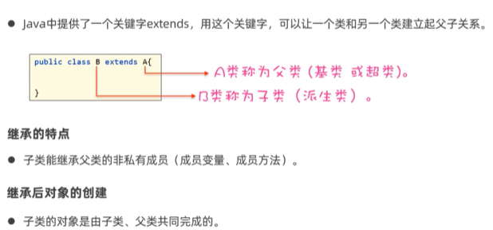  
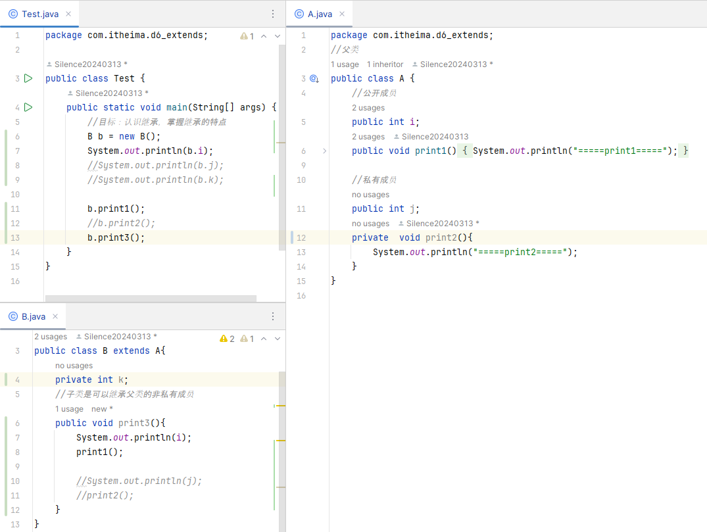  
###  设计模式：单例  

p99视频 2.42

 