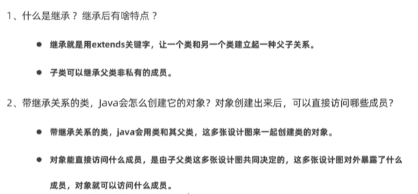
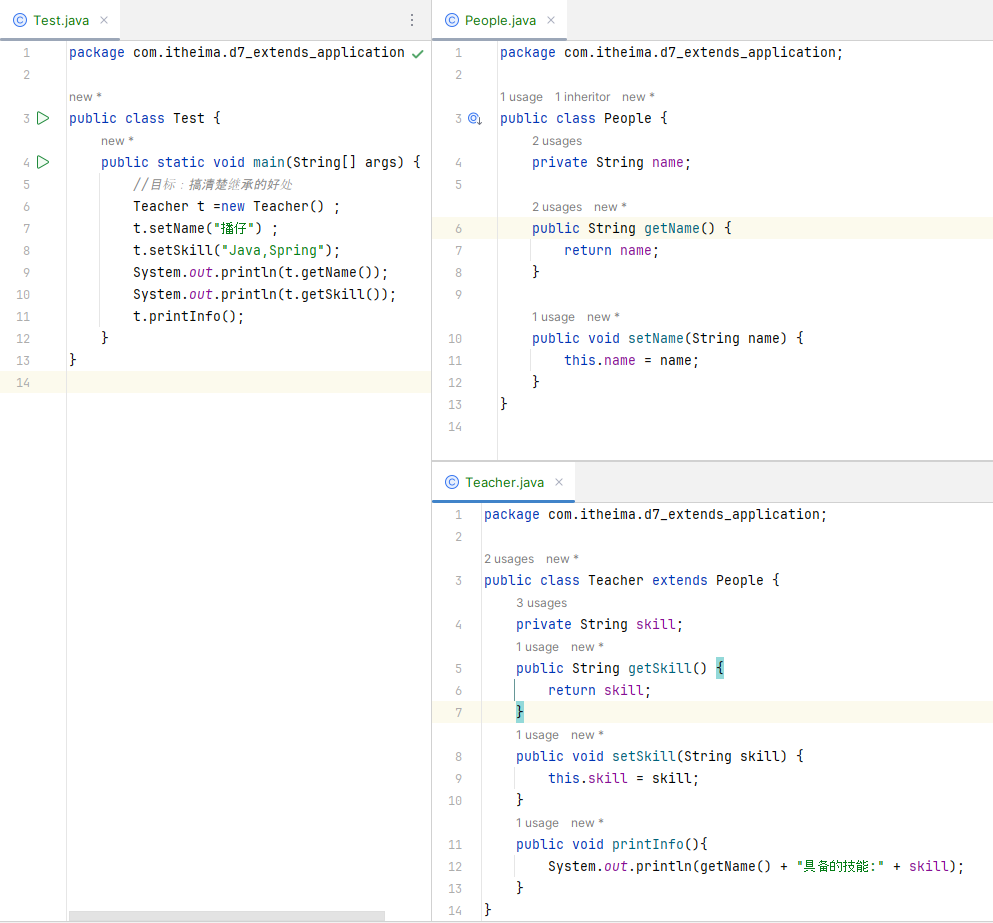
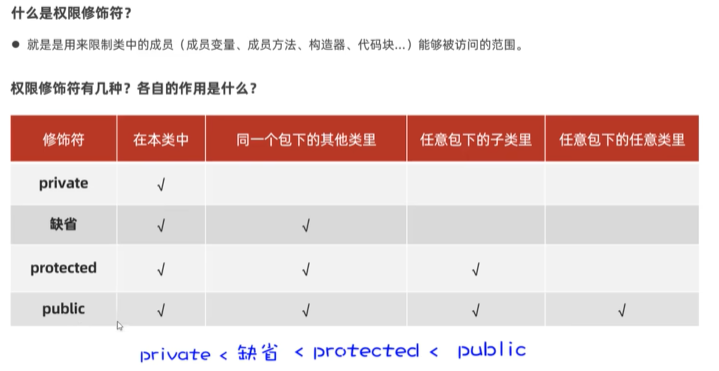
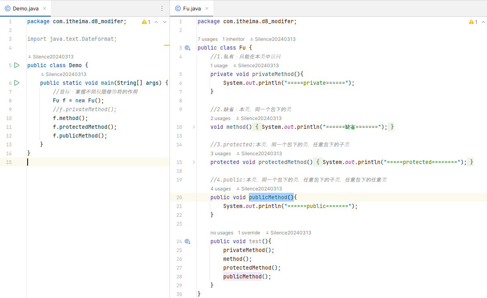
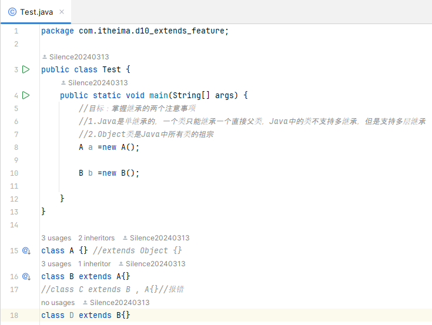
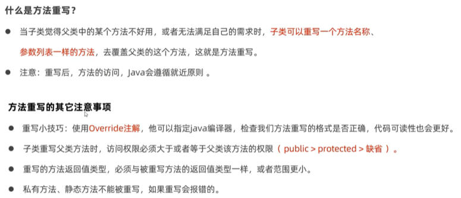
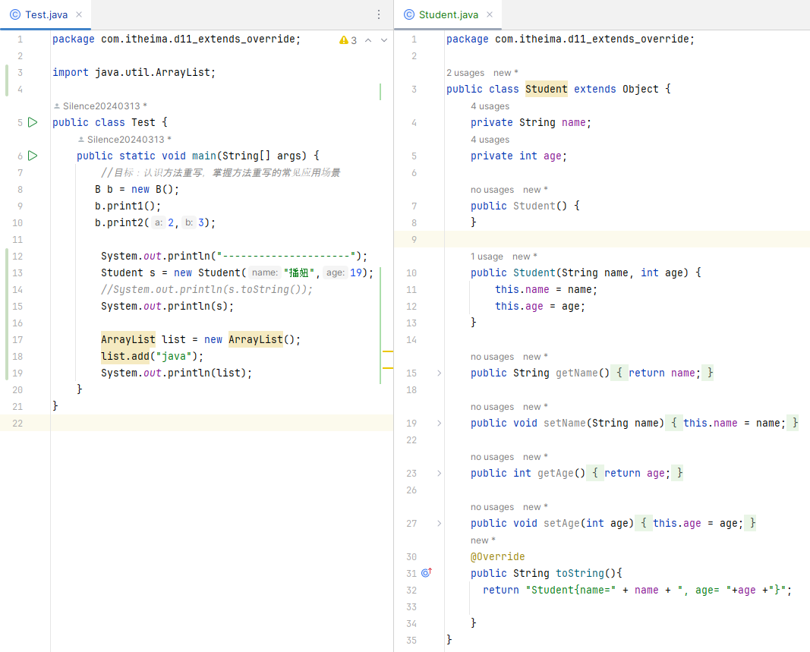
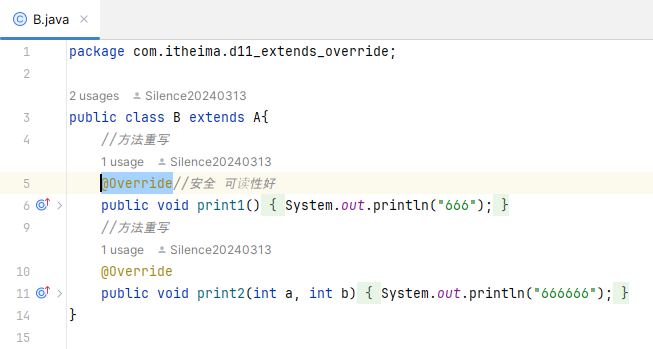

# 第二阶段 基础加强课程  

##  面向对象高级一  

###  static
1.  static修饰成员变量    
    static：叫静态，可以修饰成员变量，成员方法  
    成员变量：按照有无static修饰，分为：  
    ①类变量：有static修饰，属于类，在计算机里只有一份，会被类的全部对象共享     
    ②实例变量（对象的变量）：无static修饰，属于每个对象的  
      
      
2.  static修饰成员变量的应用场景  
在开发中，如果某个数据只需要一份，且希望能够被共享（访问，修改），则该数据可以定义成类变量来记住  
  
  
3.  static修饰成员方法   
①类方法：有static修饰的成员方法，属于类  
②实例方法：无staticc修饰的成员方法，属于对象  
  
  
4.  static修饰成员方法的应用场景   
  
5.  static的注意事项    
  
6.  static的应用知识：代码块    
  
  
7.  static的应用知识：单例设计模式  
  
  
懒汉式单例设计模式：  
  
  

###  继承  
1.  概念  
  
  
  
2. 好处：减少重复代码的编写  
  
3. 继承相关的注意事项  
①权限修饰符  
  
  
②单继承，Object类  
Java是单继承的，Java中的类不支持多继承，但是支持多层继承  
Object类Java中所有类的祖宗,我们写的任何一个类，其实都是Object的子类或子孙类  
  
③方法重写  
  
  
  
常见应用场景：子类重写Object类的toString()方法，以便返回对象的内容  
④子类中访问其他成员的特点  
就近原则  
⑤子类构造器的特点  
⑥注意事项的小结  

###  设计模式：单例  

p102   1.23

 