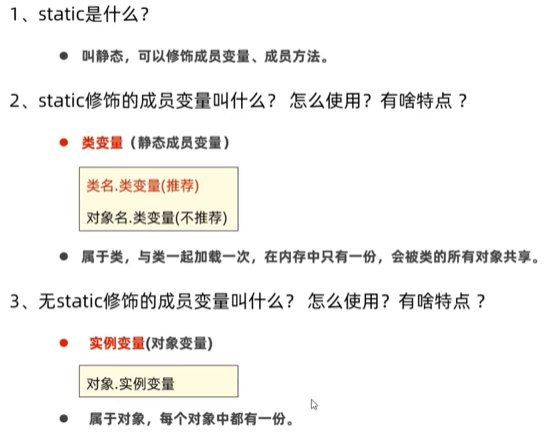

# 第二阶段 基础加强课程  

##  面向对象高级一  

###  static
1.  static修饰成员变量    
    static：叫静态，可以修饰成员变量，成员方法  
    成员变量：按照有无static修饰，分为：  
    ①类变量：有static修饰，属于类，在计算机里只有一份，会被类的全部对象共享     
    ②实例变量（对象的变量）：无static修饰，属于每个对象的  
      
      
2.  static修饰成员变量的应用场景  

3.  static修饰成员方法   

4.  static修饰成员方法的应用场景   

5.  static的注意事项    

6.  static的应用知识：代码块    

7.  static的应用知识：单例设计模式  
    
###  继承  
###  设计模式：单例  

p93个视频   15.18

 