# 第四部分 Java数组 
数组就是一个容器，用来存储一批同种类型的数据
###  数组的定义  
1.  静态初始化数组  
定义数组的时候直接给数组赋值  
①格式  
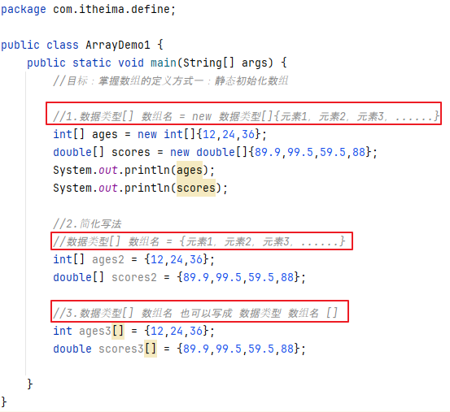  
②访问  
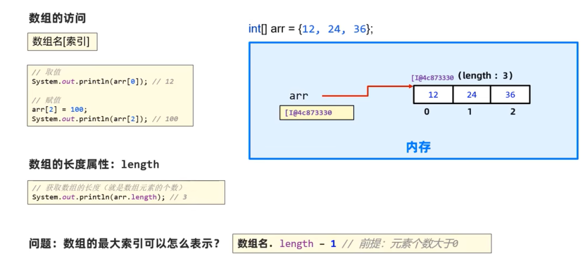  
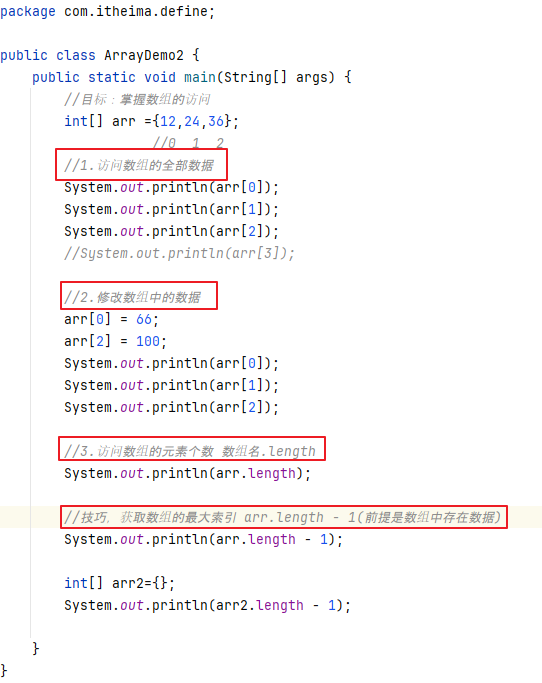  
③遍历  
一个一个数据的访问  
作用：求和 元素搜索 找最大值，最小值  
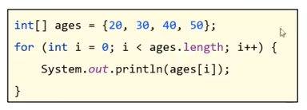  
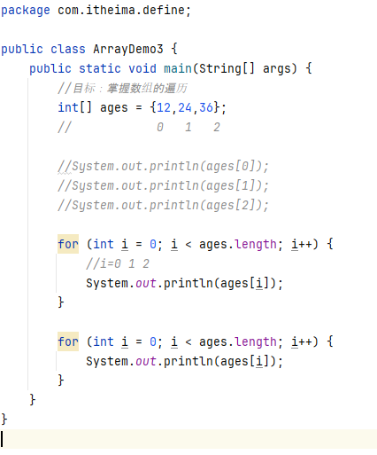  
④案例  
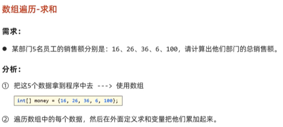  
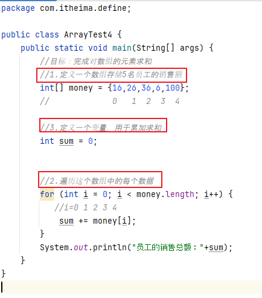  
2.  动态初始化数组  
定义数组时先不存入具体的元素值，只确定数组存储的数据类型和数组的长度  
①格式  
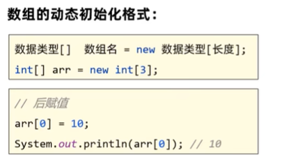  
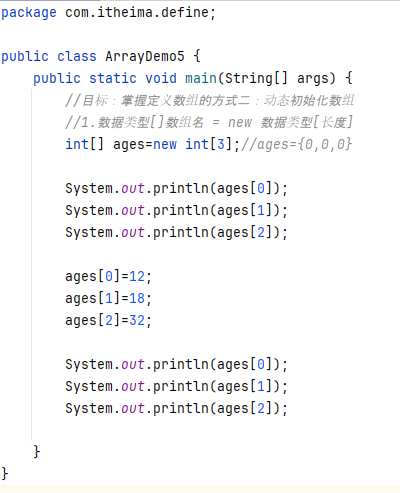  
②默认值规则  
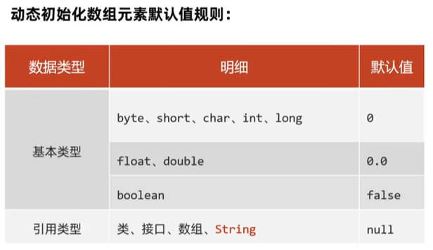  
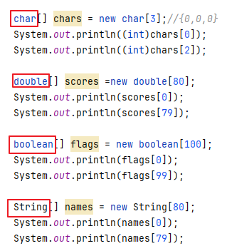  
3. 适合的业务场景  
静态初始化数组：适合一开始就知道要存入哪些元素值的业务场景  
动态初始化数组：适合开始不确定具体元素值，只知道元素个数的业务场景  
4. 案例  评委打分  
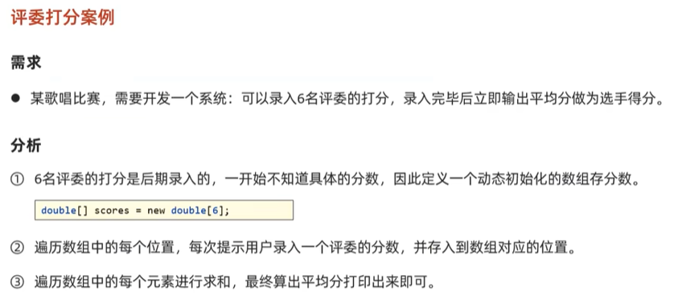  
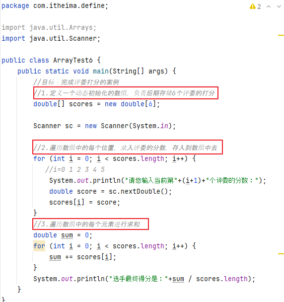  

###  Java内存分配介绍  
方法区： 字节码文件先加载到这里   
栈内存：方法运行时所进入的内存变量也是在这里  
堆内存：new出来的东西会在这块内存中开辟空间并产生地址  

###  使用数组时常见的一个问题  
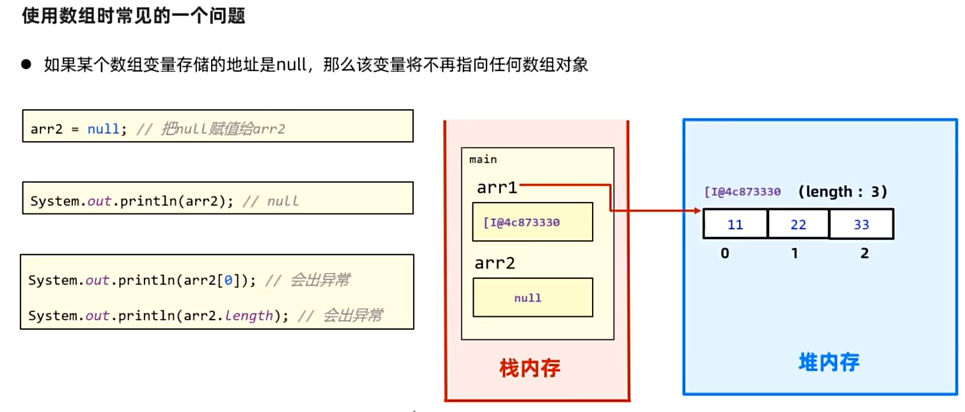  
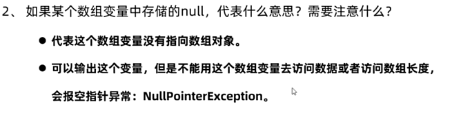  

###  多个数组变量指向同一个数据对象的原因  
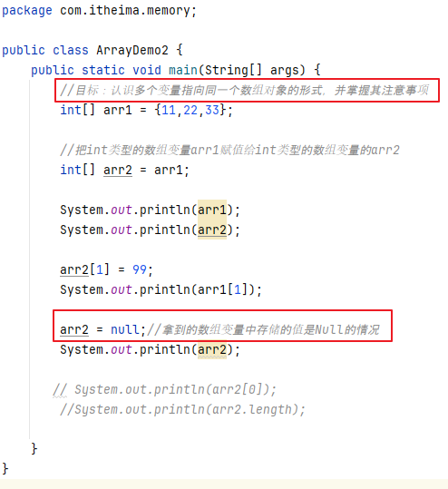  
  

###  数组常见案例  
1.  数组求最值  
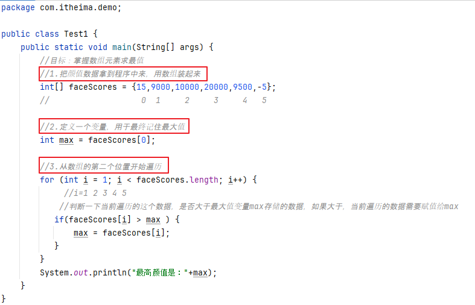  
2.  数组反转  
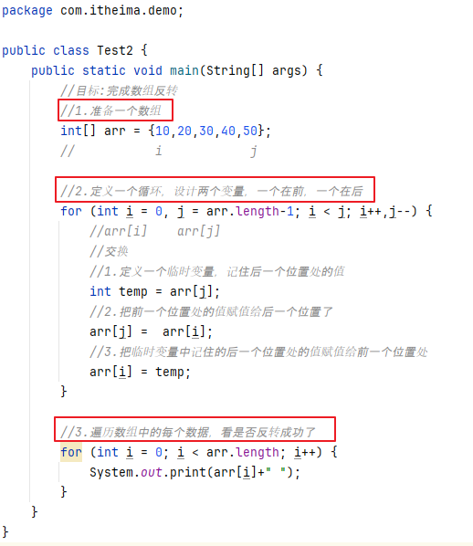  
3.  随机排名  
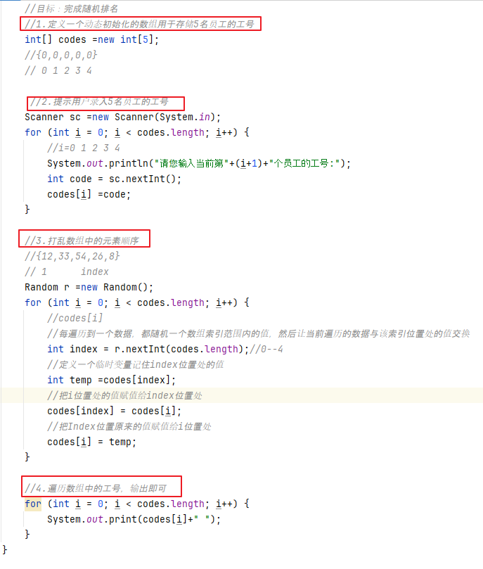  

###  Debug工具的使用  
IDEA自带的断点调试工具，可以控制代码从断点开始一行一行的执行，然后详细观看程序执行的情况  
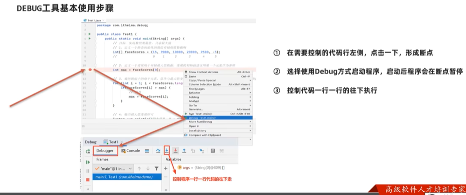

   

